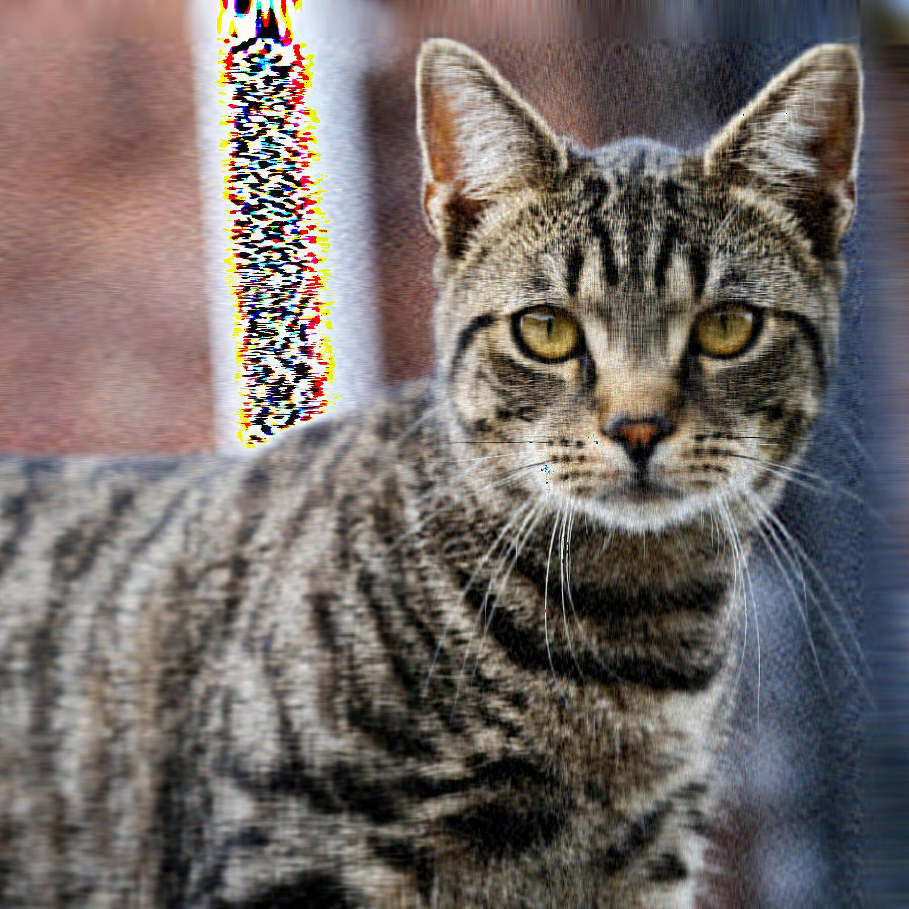

```{r setup, cache = F, echo = F, message = F, warning = F, tidy = F}

# CONFIGURACIÓN GENERAL
library(knitr)
options(width = 100)
# Opciones generales chunks

#include = FALSE evita que el código y los resultados aparezcan en el archivo terminado. R Markdown aún ejecuta el código en el fragmento y los resultados pueden ser utilizados por otros fragmentos.
#echo = FALSE evita que el código, pero no los resultados, aparezcan en el archivo terminado. Esta es una manera útil de incrustar figuras.
#message = FALSE evita que los mensajes generados por el código aparezcan en el archivo finalizado.
#warning = FALSE evita que las advertencias generadas por el código aparezcan en el final.

#fig.cap = "..." agrega un título a los resultados gráficos.

opts_chunk$set(echo=F, message = F, error = F, warning = F, comment = NA, fig.align = 'center', dpi = 100, tidy = F, cache.path = '.cache/', fig.path = './figure/')

#options(xtable.type = 'html')
knit_hooks$set(inline = function(x) {
  
  if(is.numeric(x)) {
    round(x, getOption('digits'))
  } else {
    paste(as.character(x), collapse = ', ')
  }
})
#knit_hooks$set(plot = knitr:::hook_plot_html)
```


```{r, echo=FALSE, message=FALSE, warning= F, results= F}
# Especificamos las librerías necesarias en esta lista

packages = c("imager","kableExtra","tidyverse","knitr",'dplyr','stats','cvms','tibble','gridExtra','cowplot','bestglm')

#use this function to check if each package is on the local machine
#if a package is installed, it will be loaded
#if any are not, the missing package(s) will be installed and loaded
package.check <- lapply(packages, FUN = function(x) {
  if (!require(x, character.only = TRUE)) {
    install.packages(x, dependencies = TRUE,repos='http://cran.rediris.es')
    library(x, character.only = TRUE)
  }
})

#verify they are loaded
search()


```

# Introducción

## Análisis de Componentes Principales (PCA)

El fundamento de PCA consiste en encontrar una transformación del espacio de variables de tal manera que los nuevos ejes coordenados apuntan en la dirección de mayor varianza, de mayor a menor, el primer eje apunta en la dirección de mayor varianza, el segundo en la dirección de segunda mayor varianza, etc. 

Para ello partimos de un conjunto de observaciones en un espacio de muchas variables (en nuestro caso, la base de datos de personas diabéticas, con 8 variables) y calculamos la matriz de covarianza:  

$$
[Z]_{ij} = Cov(X_i,X_j)
$$
Donde la covarianza es el grado de variación conjunta de dos variables aleatorias respecto a sus medias. Si $X, Y$ son nuestras variables y tenemos **n** muestras, siendo $(x_i, y_i)$ para $i=1,2,..,n$ los pares de valores de valores de la i-ésima muestra, entonces la covarianza de las varibles X Y se escribe:

$$
Cov(X,Y) = \frac{1}{2n^2} \sum_{i=1}^n\sum_{j=1}^n(x_i-x_j)(y_i-y_j)
$$

En el caso de los elementos diagonales de $Z$ vemos que coinciden con la varianza de la i-ésima variable.

$$
Var(X) = Cov(X,X) = \frac{1}{n^2}\sum_{i<1}(x_i-x_j)^2
$$

Las propiedades de la matriz $Z$ garantizan la existencia de una base de vectores propios de esta. Es decir que exiten unos vectores del espacio $v_i$ y unos autovalores $\lambda_i$ tal que:

$$
Zv_i = \lambda_i v_i
$$

La matriz que conforman estos vectores es la **matriz de cambio de base** desde las coordenadas originales (nuestras variables) hasta un nuevo sistema de coordenadas donde cada dirección corresponde con una dirección en la que nuestros datos se distribuyen con una varianza $\lambda_i^2$. 

$$
[S]_{ij} = [v_i]_j
$$

Con esto podemos transformar nuestros datos de la siguiente manera:

$$
x_i' = S^{-1}x_i
$$
*Para vectores de datos* $x_i$

$$
A' = SAS^{-1}
$$
*Para matrices*

--- 

Si ordenamos los vectores segun sus autovalores al construir la matriz tenemos el cambio de coordenadas que estábamos buscando. Donde las componentes PC_i están ordenadas de mayor a menor varianza.


En general, esto nos sirve para transformar nuestros datos y quedarnos solo con las primeras direcciones PC_i en las que se acumule la mayor parte de la varianza de nuestro conjunto de datos.

Existen varios criterios con los que elegir con cúantas componentes nos quedamos. Una opción es quedarnos con aquellas direcciones con varianza mayor que 1: $\lambda_i^2 \geq 1$.

También podemos quedarnos con una cantidad de componentes $k$ tal que la suma de sus varianzas sea una fracción importante de la total. Es decir, que podamos explicar un alto porcentaje de la varianza de los datos solo con esas primeras $k$ componentes. 


# Datos utilizados 
Hemos elegido el dataset llamdo **Diabetes Dataset** descargado desde la plataforma online [Kaggle](https://www.kaggle.com/datasets/akshaydattatraykhare/diabetes-dataset)

Un problema cuando intentamos PCA sobre datasets es cómo tratar las variables categóricas, así que tras considerar muchos datasets diferentes hemos optado por este, pues no contiene ninguna variable categórica salvo 'Outcome' (si el paciente es diabético o no, 1 vs 0), que no usaremos al hacer la PCA. Más adelante construiremos modelos que intentarán predecir cuál es el estado del paciente basandose en los datos originales y en las componentes principales de la PCA, así comporbaremos si nuestra aproximación es válida.


Empezamos analizando el conjunto de datos descargado.
```{r, results='hide'}
# Diabetes

Diabetes <- read.csv(file= './data/diabetes.csv')

Diabetes %T>% head %>% str

# No hay valores ausentes, el dataframe ya está masticadito para su uso.
sum(Diabetes[which(is.na(Diabetes))])
```

Seleccionamos todas las columnas menos *Outcome*, para implementar el algoritmo PCA con la función ``prcomp()`` disponible en la librería ``stats``.  

Esta función devuelve una estructura de datos tipo Dataframe que contiene tanto los valores propios (covarianza), la matriz de rotación para cambiar de las coordenadas {x_i} a las {PCn}. pca$x contiene las coordenadas de los registros en la nueva base.

```{r, results='hide'}

# Chunk genérico para lelvar a cabo PCA, el dataset debe estar filtrado y ser almacenado en la variable Dataset
Datos <- Diabetes %>% select(-Outcome)
head(Datos)

# Implementamos la función prcomp, que nos devuelve una estructura de datos tipo
pca <- prcomp(Datos, center = T , scale. = T)
summary(pca)

#Dataframe expresado en las nuevas variables PCn
head(pca$x)

#Matriz de rotación:
head(pca$rotation)

```

## Análisis de la PCA

Una vez tenemos la matriz de rotación y los autovalores, podemos extraer conclusiones sobre qué variables están más correlacionadas y utilizar un criterio para quedarnos con un número reducido de componentes de la base transformada {PCn}.

Podemos ver qué autovalores tienen una covarianza mayor si los representamos unos frente a otros.

Representamos la covarianza acumulada (la suma acumulada de los autovalores).

```{r}
screeplot(pca,type = 'line', npcs = length(Datos), main = 'Diabetes')
abline(h=1,col='red')
# Plots de Victor
plot(pca$sdev^2 / sum(pca$sdev^2), type= 'o', main = 'PCA components', ylab = 'Normalized std. Deviation', xlab ='PCA component')  
plot(cumsum(pca$sdev^2 / sum(pca$sdev^2)), type="o", ylab= 'Cumulative Norm. std.', xlab = 'total # of components',
     main ='PCA components')

```

Vemos que solo hay 3 autovalores superiores a 1, además con esos 3 tenemos una covarianza acumulada de 0.6069. Es decir, somos capaces de explicar el 60% de la covarianza de los datos con esas tres variables.

Utilizamos un método numérico para elegir cuántas componentes conservamos.

Con el criterio std^2 >1, Obtenemos 3 valores con varianza superior a la unidad, luego trabajaremos con las componentes PC1, PC2 y PC3.

```{r}
# pca$sdev^2

usefull <- pca$sdev[which(pca$sdev^2 >1)]
usefull # componentes con autovalor mayor que 1

```


## Exploración gráfica: Biplot

Aveces es muy ilustrador representar los puntos en la nueva base, sin embargo, como tenemos 8 dimensiones es imposible hacernos una idea completa de cómo están relacionadas las variables. Sin embargo, si proyectamos sobre las dimensiones de mayor varianza sabemos que no nos estamos perdiendo mucho detalle de cómo están relacionadas.


```{r}
# En este bloque dibujamos el biplot para hacernos una idea de cómo se relacionan las variables
pca %>% biplot(cex = c(0.1,0.4),col= c('blue','red'))
```
En este biplot, hemos proyectado los datos sobre las componentes PC1 y PC2, así como los vectores que representan la dirección en la que varían las variables originales.  

La nube de muestras está muy dispersa, lo que es de esperar pues estas dos componentes son las que presentan mayor varianza. Lo interesante es ver que las variables originales apuntan en una dirección que, poryectada sobre estos ejes, parece indicar que existe una correlación clara entre 3 grupos de variables.

Para constrastar, vamor a proyectar sobre PC1 y sobre PC6 (varianza mucho menor)

```{r}
pcafilx <- data.frame(pca$x[,1],pca$x[,8])
colnames(pcafilx) <- c('PC1','PC8')

pcafilrot <- data.frame(pca$rotation[,1],pca$rotation[,8])
colnames(pcafilrot) <- c('PC1','PC8')

  biplot(pcafilx, pcafilrot,cex = c(0.1,0.4),col= c('blue','red'))
```
Si nos fijamos en los ejes que corresponden a las componentes de la matriz de rotación vemos que la proyección sobre la dirección PC8 es menor que la de PC1, es decir, los puntos se aglutinan más en la dirección PC8 que en la PC1 (la varianza de PC1 es mayor que la de PC8). 

Al tratar con espacios con muchas dimensiones es dificil extraer conclusiones de representaciones gráficas necesariamente incompletas.


Otra herramienta de la que disponemos es la matriz de rotación, que representa qué combinación lineal de las variables originales construyen las nuevas componentes. Una forma visual de ver qué variables reales tienen más peso en cada componente es ver la matriz con un mapa de calor o ``heatmap()``.

```{r}
heatmap(pca$rotation)
# kable(pca$rotation)
```

Podemos ver que PC1 está construida con una suma más o menos equitativa entre todas las variables,

PC2 le da más peso a las variables *Age*, *Pregnancies*, *Glucose* y *Blood Pressure*

PC3 parece ser una combinación principalmente formada por el nivel de *Insulina*, la *Glucosa* y la *función pedigree de diabetes*. 

Con esto podemos tener una baga idea de qué estamos haciendo cuando empleamos estas nuevas variables.   

Estamos reinterpretando juntas aquellas variables que están correlacionadas, utilizando una sola. En este caso las variables PC2 y PC3 tienen una interpretación humana bastante clara. PC2 hace referencia a variables muy correlacionadas con la edad del paciente y PC3 aglomera los parámetros relacionados con los indicadores biológicos de la diabetes.

## Exploración visual

### Representación por grupos: Enfermos vs Sanos

Vamos a representar los datos en este espacio transformado utilizando las tres primeras componentes de la PCA, con la esperanza de que veamos grupos claramente separables al colorear los datos por su condición (diabético o no diabético)

```{r}
DiabetesSanos <- Diabetes[which(Diabetes$Outcome == 0),]

PC1_S <- rowSums(pca$rotation[,1] * DiabetesSanos) #Coordenada X 

PC2_S <- rowSums(pca$rotation[,2] * DiabetesSanos) # Coorndenada Y 

PC3_S <- as.matrix(rowSums(pca$rotation[,3] * DiabetesSanos)) # Color Z de cada pareja X,Y

PCS <- data.frame(PC1_S , PC2_S, PC3_S)
#############

DiabetesEnfermos <- Diabetes[which(Diabetes$Outcome == 1),]

PC1_E <- rowSums(pca$rotation[,1] * DiabetesEnfermos) #Coordenada X 

PC2_E <- rowSums(pca$rotation[,2] * DiabetesEnfermos) # Coorndenada Y 

PC3_E <- as.matrix(rowSums(pca$rotation[,3] * DiabetesEnfermos)) # Color Z de cada pareja X,Y

PCE <- data.frame(PC1_E,PC2_E,PC3_E)


PCE %>% ggplot(aes(PC1_E, PC2_E)) + geom_point(size=2 , color = 'red', alpha = 0.5) +
  geom_point(data = PCS,aes(x=PC1_S,y=PC2_S), size =2 , color = 'blue', alpha = 0.5) +
  xlab('PC_1') + ylab('PC_2') 

PCE%>%
  ggplot(aes(PC1_E,PC3_E)) + geom_point( color='red', alpha=0.5) +
  geom_point(data=PCS, aes(x=PC1_S,y = PC3_S), color='blue', alpha= 0.5)+
  xlab('PC_1') + ylab('PC_3')

PCE %>% ggplot(aes(PC2_E, PC3_E)) + geom_point(size=2 , color = 'red', alpha = 0.5) +
  geom_point(data = PCS,aes(x=PC2_S,y=PC3_S), size =2 , color = 'blue', alplha = 0.5)+
  xlab('PC_2') + ylab('PC_3')

```

A primera vista con estas tres representaciones no parece que el problema de clasificación sea separable. Es cierto que parece que los pacientes sanos (en azul) se distribuyen en dos líneas muy pobladas, esto puede ser suficiente para cosntruir un modelo clasificador razonablemente acertado, así que vamos a intentarlo.


<!-- Supongo que esto estara dentro de una seccion propia, hay que modificar los encabezados segun esta, tal vez el primer parrafo hay que modificarlo tambien-->

# PCA en algoritmos clasificadores

Uno de los usos más habituales de la PCA es su uso aplicado a los problemas de predicción que trata la disciplina del machine learning y la estadística. El uso de las variables que más variabilidad del problema explican ayudan a reducir la dimensionalidad del problema, permitiendo que un problema de 8 predictores en el caso de nuestro problema de ejemplo se reduzcan a 3 predictores mediante el uso de la PCA. Esto se hace perdiendo poder explicativo de nuestros datos de entrenamiento, ya que al escoger solo las 3 primeras variables de la PCA que explican más variabilidad estamos perdiendo un poco del poder explicativo que nos aportan las 8 variables del sistema. Sin embargo, explicar más variabilidad en un problema no es siempre conveniente cuando nuestra idea es hacer una predicción sobre datos nuevos. Queremos predecir datos nuevos, no explicar los datos que ya tenemos. Queremos que nuestro modelo sea capaz de adaptarse a estas nuevas entradas, es aquí donde la PCA muestra su utilidad, ya que nos evita un problema habitual a la hora de crear predictores. El _overfitting._

El overfitting se define como la produccion de un análisis (o modelo) cuyos resultados ajusta demasiado o es exactamente igual al de un dataset o grupo de datos de entrenamiento y que por tanto fallará a la hora de generalizar, es decir, predecir datos futuros o datos que no habia observado durante su proceso de entrenamiento 

## Árboles binarios en un Random Forest.

El resultado de entrenar nuestro modelo de ambas formas y probarlo contra unos datos de validación es el siguiente:

```{r  echo=FALSE, message=FALSE, warning= F, results= F}
library(randomForest)
library(mlbench)
library(caret)
library(e1071)
set.seed(1) #No parece haber variación en mi ordenador, pero por asegurar

datasetTrain <- pca$x[1:500,]
datasetTest <- pca$x[501:dim(pca$x)[1],]
train.data<-data.frame(outcome=Diabetes$Outcome[1:500],datasetTrain[,1:3])
control <- trainControl(method="repeatedcv", number=10, repeats=3)
mtry <- sqrt(ncol(train.data))
tunegrid <- expand.grid(.mtry=mtry)
model_rf <- train(outcome~.,data=train.data, method="rf",tuneGrid=tunegrid, trControl=control)

prediction_rf<-predict(model_rf, newdata=train.data)
m1mod<- confusionMatrix(as.factor(round(prediction_rf)),as.factor(train.data$outcome))

test.data<-data.frame(datasetTest)
test.data <- test.data[,1:3]
pred_test <- predict(model_rf, test.data)
m1test<- confusionMatrix(as.factor(round(pred_test)),as.factor(Diabetes$Outcome[501:length(Diabetes$Outcome)]))

datasetTrain <- Diabetes[1:500,]
datasetTest <- Diabetes[501:dim(Diabetes)[1],]
train.data<-data.frame(outcome=Diabetes$Outcome[1:500],datasetTrain[,1:8])
control <- trainControl(method="repeatedcv", number=10, repeats=3)
mtry <- sqrt(ncol(train.data))
tunegrid <- expand.grid(.mtry=mtry)
model_rf <- train(outcome~.,data=train.data, method="rf",tuneGrid=tunegrid, trControl=control)

prediction_rf<-predict(model_rf, newdata =train.data)
m2mod<- confusionMatrix(as.factor(round(prediction_rf)),as.factor(train.data$outcome))

test.data<-data.frame(datasetTest)
test.data <- test.data[,1:8]
pred_test <- predict(model_rf, test.data)
m2test<- confusionMatrix(as.factor(round(pred_test)),as.factor(Diabetes$Outcome[501:length(Diabetes$Outcome)]))
```

```{r}
trainAll <- as_tibble(as.table(m1mod))
gmAll<-plot_confusion_matrix(trainAll, 
                      target_col = "Reference", 
                      prediction_col = "Prediction",
                      counts_col = "n",
                      add_normalized = FALSE)+ ggtitle("Train All")

testAll <- as_tibble(as.table(m1test))
gtAll<-plot_confusion_matrix(testAll, 
                      target_col = "Reference", 
                      prediction_col = "Prediction",
                      counts_col = "n",
                      add_normalized = FALSE)+ ggtitle("Test All")

trainPCA <- as_tibble(as.table(m2mod))
gmPCA<-plot_confusion_matrix(trainPCA, 
                      target_col = "Reference", 
                      prediction_col = "Prediction",
                      counts_col = "n",
                      add_normalized = FALSE)+ ggtitle("Train PCA")

testPCA <- as_tibble(as.table(m2test))
gtPCA <-plot_confusion_matrix(testPCA, 
                      target_col = "Reference", 
                      prediction_col = "Prediction",
                      counts_col = "n",
                      add_normalized = FALSE)+ ggtitle("Test PCA")


grid.arrange(gmAll, gtAll, gmPCA,gtPCA,
          ncol = 2, nrow = 2)
```

Nuestro modelo de Random Forest sin aplicar PCA presenta overfitting, como podemos observar en la matriz de confusión, prediciendo los datos de entrenamiento de forma perfecta, pero con una efectividad baja a la hora de predecir los datos que hemos reservado para su validación. Sin embargo, el modelo que utiliza PCA muestra un mayor poder predictivo, ya que no parece estar sobreajustando nuestros datos, a pesar de usar menos predictores es más efectiva a la hora de realizar predicciones, con lo que no solo es más eficiente por usar menos predictores, también por su efectividad a la hora de predecir los datos.

## PCA y regresión logística

Dado que los algoritmos tipo random forest presentan cierta tendencia al overfitting, vamos a comprobar como se comporta otro tipo de algoritmo de clasificación cuando aplicamos una PCA. En este caso utilizaremos la regresión logística. 

Siguiendo el criterio expuesto en la sección donde exponemos los [fundamentos de la PCA][Análisis de Componentes Principales (PCA)], vamos a realizar una regresión logística utilizando las tres primeras componentes principales, ya que son las tres componentes que presentan un $\lambda ^2 > 1$, para luego comparar su rendimiento con otro modelo de tres predictores seleccionados mediante un método basado en el criterio de Akaike. Esto equivale a buscar los tres predictores que mas varianza de la variable salida explican tanto en la base vectorial original como en la base de componentes principales. En las siguientes figuras se compara el rendimiento de los dos modelos regresivos.

```{r, echo = F}
library(bestglm)
reg_db <- bestglm(Diabetes[1:500,], family = binomial, IC = "AIC", nvmax = 3)
```

```{r}
reg_db <- glm(Outcome ~ Pregnancies + Glucose + BMI, data = Diabetes, family=binomial())

PCAcomp <- as.data.frame(pca$x)
names(PCAcomp) <- paste(rep("PC", 8), 1:8)
PCAcomp$Outcome <- Diabetes$Outcome

reg_pc <- glm(Outcome ~ `PC 1` + `PC 2` + `PC 3`, data = PCAcomp[1:500,], family=binomial())
```

```{r}
library(cvms)
pred_db_t <- round(predict(reg_db, newdata = Diabetes[501:768, c(1, 2, 6)], type = "response"))
pred_db_m <- round(predict(reg_db, newdata = Diabetes[1:500, c(1, 2, 6)], type = "response"))
pred_pc_t <- round(predict(reg_pc, newdata = PCAcomp[501:768, 1:3], type = "response"))
pred_pc_m <- round(predict(reg_pc, newdata = PCAcomp[1:500, 1:3], type = "response"))

cm_db_t <- confusion_matrix(Diabetes$Outcome[501:768], pred_db_t)
cm_db_m <- confusion_matrix(Diabetes$Outcome[1:500], pred_db_m)
cm_pc_t <- confusion_matrix(Diabetes$Outcome[501:768], pred_pc_t)
cm_pc_m <- confusion_matrix(Diabetes$Outcome[1:500], pred_pc_m)

p11 <- plot_confusion_matrix(as.data.frame(cm_db_m$`Confusion Matrix`)[,c(1, 2, 5)], 
                      target_col = "Target", 
                      prediction_col = "Prediction",
                      counts_col = "N",
                      add_normalized = FALSE)+ ggtitle("Entrenamiento en base original")

p12 <- plot_confusion_matrix(as.data.frame(cm_db_t$`Confusion Matrix`)[,c(1, 2, 5)], 
                      target_col = "Target", 
                      prediction_col = "Prediction",
                      counts_col = "N",
                      add_normalized = FALSE)+ ggtitle("Test en base original")

p21 <- plot_confusion_matrix(as.data.frame(cm_pc_m$`Confusion Matrix`)[,c(1, 2, 5)], 
                      target_col = "Target", 
                      prediction_col = "Prediction",
                      counts_col = "N",
                      add_normalized = FALSE)+ ggtitle("Entrenamiento en base PC")

p22 <- plot_confusion_matrix(as.data.frame(cm_pc_t$`Confusion Matrix`)[,c(1, 2, 5)], 
                      target_col = "Target", 
                      prediction_col = "Prediction",
                      counts_col = "N",
                      add_normalized = FALSE)+ ggtitle("Test en base PC")

grid.arrange(p11, p12, p21, p22,
          ncol = 2, nrow = 2)
```

Como vemos, realizar un análisis de componentes principales en este caso no ayuda en absoluto. Esto es debido a que la regresión logística no presenta la tendencia al overfitting que presentan los algoritmos tipo random forest, por lo que no tenemos que aplacar este efecto. Además, no hay ninguna razón para pensar que la base de componentes principales vaya a ser mas apropiada que la originar para tratar este problema. Esto nos lleva a preguntarnos cuándo va a resultarnos útil la base de componentes principales.

### Colinealidad

La colinealidad implica fuertes relaciones entre las componentes de un dataset. Este problema afecta sobre todo a los problemas regresivos, ya que desdibuja el comportamiento lineal de los predictores. Para este tipo de problemas es deseable encontrar un nuevo espacio vectorial en el que los vectores de la base sean linealmente independientes. Este es el caso de la base formada por las componentes principales. Cuando tenemos un problema el cual queremos tratar con regresion lineal y sus componentes presentan unas correlaciones muy altas, la solución es aplicar una PCA.

En nuestro dataset, no teniamos este problema, por lo que la base de componentes principales no representaba una opción particularmente mejor que el dataset original.

```{r}
corrplot::corrplot(cor(select(Diabetes, -Outcome)), method = "number")
```

Utilizando unos datos con fuertes correlaciones podemos ver que la PCA nos mejora el modelo y además reduce la dimensionalidad. En el paquete `scikit-learn` de `python` podemos encontrar el dataset `breast_cancer`, el cual presenta fuertes correlaciones y en el que una aplicación de la PCA nos proporciona muy buenos resultados. De un primer modelo regresivo con un 93% de acierto en los datos reservados para el test y 30 predictores a un acierto del 96% y solamente 6 predictores.\footnote{https://medium.com/@alepukhova526/principal-component-analysis-for-logistic-regression-with-scikit-learn-869b04b2f923}

## PCA aplicada a imágenes.

Un uso de la PCA ya fuera de su aplicación en algoritmos de machine learning es la compresión de imagenes, siguiendo la misma lógica que en otros casos, una imagen, que a nivel digital es una matriz de forma (longitud x anchura x componentes de color) no deja de ser lo mismo que un dataset, un grupo de datos relacionados entre ellos, organizados en filas y columnas, con una cierta correlacion entre los datos de la misma. Un punto negro en una imagen va a estar correlacionado con los valores cercanos a el, que seran tambien negros o una transicion progesiva a otro color en la mayoria de los casos. Utilizando esto podemos aplicar la PCA y tratar de reconstruirla con menos de las componentes originales. Obviamente nuestra imagen va a perder calidad y es posible que aparezcan artefactos en la misma, pero, si nuestro objetivo es simplemente enviar una imagen o almacenar imágenes ocupando lo mínimo posible en nuestro equipo puede ser una alternativa viable y una gran manera de comprimirlas y poder seguir trabajando con ellas en el formato que deseemos.

En nuestro caso de ejemplo, una persona puede distinguir que lo que representa la imagen con solo 14 componentes, el gato, aunque no definido, es perfectamente distinguible para un ser humano y también para una IA entrenada para etiquetar lo que ve en una foto, como comprobamos utilizando google lens, devolviendo el resultado correcto, una búsqueda de gatos. 


Esto lo hemos conseguido con una imagen que pesa solo un 34.73% de la imagen original. 

Si queremos una definición mayor, podríamos escoger la imagen que utiliza 69 componentes, esta pesará un 62.20% de la imagen original pero el gato es perfectamente visible.


{width=25%, height=25%}


La imagen con 225 componentes nos otorgaría un gato con una definición indistinguible de la original y que, si ignoramos los artefactos, es idéntica a la original con solo un 75% del peso original.

```{r}
p1 <- ggdraw() + draw_image("images/gato_225_components.jpg", scale = 0.95) 
p2 <- ggdraw() + draw_image("images/gato.jpg", scale = 0.95) 

grid.arrange(p1, p2, ncol = 2)
```

